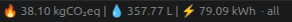

# EcoLogist status bar extension for VS Code

Shows the estimated environmental impact of your Claude Code session in the VSCode status bar.

This includes greenhouse gas emissions (CO₂), water consumption, and energy consumption are displayed in the status bar, based on the [EcoLogits](https://ecologits.ai/latest/) model and data. 

The extension has three modes:

- **Last use**: shows only the last session's impact.
- **Workspace**: shows cumulative impact for all sessions in the current workspace.
- **All time**: shows cumulative impact across all projects and all time.

It's an adaptation of the [ecologits-statusline](https://github.com/DuarteVi/ecologits-statusline) project.
